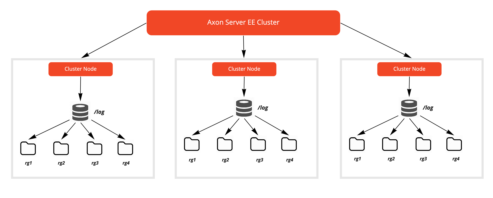

# Replication Groups

Within a single cluster you can define _**replication groups**_. A replication group is responsible for transaction coordination as well as event data replication among the various nodes within the cluster. 

A visual representation of Replication Groups is depicted below.

Each node has a specific role in a replication group. The nodes in a replication group will elect a leader which will be responsible for managing transactions in the replication group. Within a replication group you can define a number of contexts \(see the in the [multi-context](multi-context.md) section\).

### Node Roles

When you define a replication group, you assign nodes that will serve that replication group.

A node can have different roles in a context:

* A “PRIMARY” node is a fully functional \(and voting\) member of that replication group. 

  A majority of primary nodes is needed for a replication group to be available to client applications.

* A “MESSAGING\_ONLY” member will not provide event storage, and \(as it is not involved with the transactions\) is a non-voting member of the replication group.
* An “ACTIVE\_BACKUP” node is a voting member which provides an event store for each context in the replication group, but it does not provide the messaging services, so clients will not connect to it. Note that you must have at least one active backup node that needs to be up if you want a guarantee that you have up-to-date backups.
* A “PASSIVE\_BACKUP” will provide event stores, but not participate in transactions or even elections, nor provide messaging services. It being up or down will never influence the availability of the replication group, and the leader will send any events accumulated during maintenance, as soon as it comes back online.
* Lastly, a "SECONDARY" node will provide event stores, but not participate in transactions or even elections, nor provide messaging services. The leader will send any events accumulated during maintenance, as soon as it comes back online. When there 

  are secondary nodes in a replication group, the primary nodes will only keep the most recent data in their event store. 

There are multiple options available of assigning roles to nodes within a replication group. The Command Line interface section details this out in the [clusters](admin-configuration/command-line-interface.md#cluster-enterprise-edition-only) and [replication groups](admin-configuration/command-line-interface.md#replication-groups-enterprise-edition-only) sub-sections.

### Consensus/Elections

All nodes serving a particular context maintain a complete copy, with a “replication leader” in control of the distributed transaction. The leader is determined by elections, following the [RAFT protocol](https://raft.github.io/). An important consequence has to do with those elections: nodes need to be able to win them, or at least feel the support of a clear majority i.e. To have a valid leader for a context, a _**majority of the nodes must be active**_ \(e.g. when you have a cluster with 3 nodes, you need at least 2 active nodes, for a cluster of 4 nodes you would need 3 active nodes\).‌ The leader orchestrates the distributed transaction \(i.e. replication of data between the nodes\) and confirms to clients when transactions are committed.

While an Axon Server cluster does not need to have an odd number of nodes, every individual replication leader does, to prevent the chance for a draw in an election. This also holds for the internal context named “\_admin”, which is used by the admin nodes and stores the cluster structure data. As a consequence most clusters will have an odd number of nodes, and will keep functioning as long as a majority \(for a particular context\) is responding and storing events.

### Special Replication Group

Axon Server EE has one special replication group and context, called "\_admin". This context is used to process all configuration changes in Axon Server, so it contains the master configuration from which all replication groups get their information.‌ You cannot add additional context to the "\_admin" replication group.

